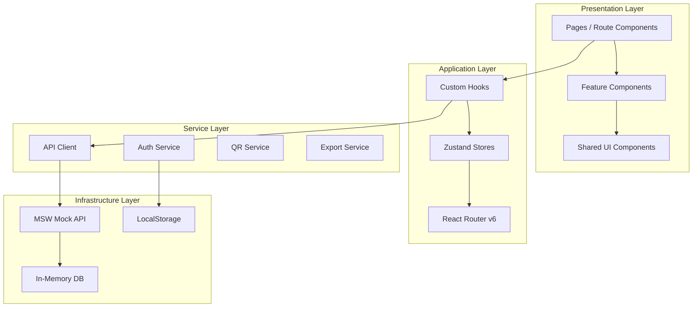
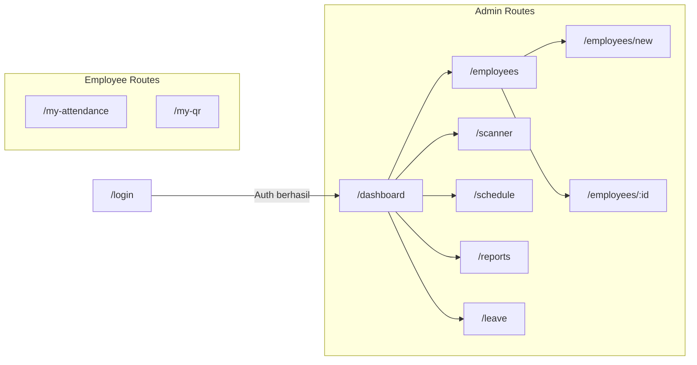
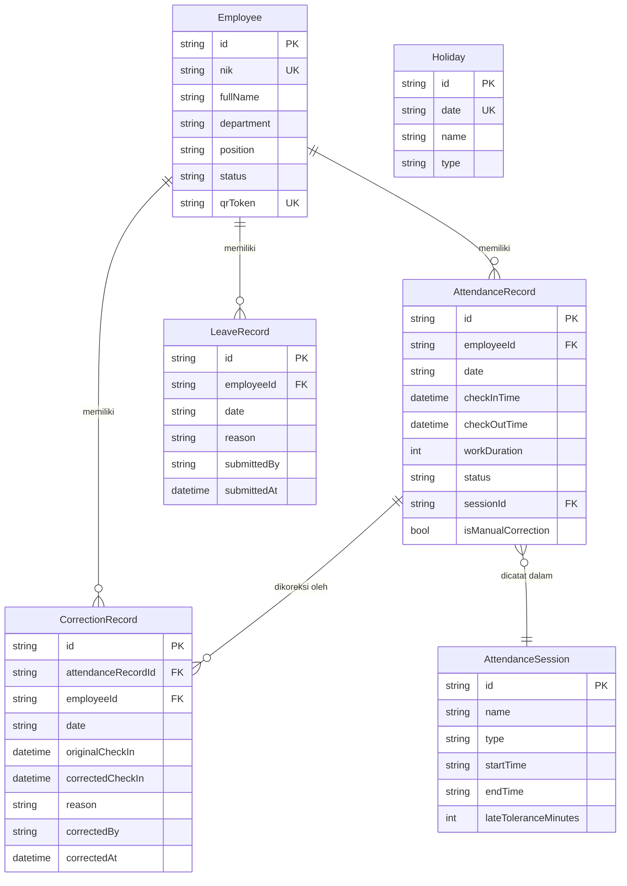

# Dokumen Desain Teknis — HR Mini App

## Daftar Isi

1. [Overview](#overview)
2. [Arsitektur](#arsitektur)
3. [Komponen dan Antarmuka](#komponen-dan-antarmuka)
4. [Model Data](#model-data)
5. [Correctness Properties](#correctness-properties)
6. [Penanganan Error](#penanganan-error)
7. [Strategi Testing](#strategi-testing)

---

## Overview

HR Mini App adalah aplikasi web manajemen kehadiran karyawan berbasis QR code yang dibangun dengan React + TypeScript. Aplikasi ini melayani dua peran utama: **Admin** (staf HR / manajer) dan **Karyawan**.

### Tujuan Utama

- Karyawan melakukan absensi masuk/keluar secara mandiri dengan memindai QR code unik mereka.
- Admin mengelola data karyawan, mengonfigurasi jadwal kerja, memantau rekap kehadiran secara real-time, dan mengekspor laporan ke Excel.
- Sistem mencatat izin dan koreksi absensi dengan audit trail yang lengkap.

### Batasan Lingkup

- Aplikasi berjalan sepenuhnya di sisi klien (front end only) dengan Mock API berbasis MSW.
- Tidak ada backend nyata; semua data disimulasikan dengan latensi realistis 200–800ms.
- Deployment publik ke Vercel atau Netlify.

### Standar Kualitas

| Aspek | Target |
|---|---|
| TypeScript | Strict mode, tanpa `any` eksplisit |
| Code Coverage | ≥ 70% |
| Lighthouse Performance | ≥ 85 |
| Aksesibilitas | WCAG 2.1 Level AA |
| Dark Mode | Didukung penuh |
| Latensi Mock API | 200–800ms per respons |

---

## Arsitektur

### Diagram Arsitektur Tingkat Tinggi



### Layer Penjelasan

| Layer | Tanggung Jawab |
|---|---|
| **Presentation** | Render UI, handle event pengguna, menampilkan state |
| **Application** | State global (Zustand), routing, custom hooks sebagai jembatan |
| **Service** | Logika bisnis murni: autentikasi, QR generation, export Excel/PDF |
| **Infrastructure** | MSW sebagai mock backend, localStorage untuk persistensi sesi/tema |

### Prinsip Desain

1. **Separation of Concerns** — Setiap layer hanya mengetahui layer di bawahnya.
2. **Feature-First Folder Structure** — Kode diorganisir per fitur, bukan per tipe file.
3. **Unidirectional Data Flow** — State mengalir dari store → hook → komponen.
4. **Optimistic UI** — Aksi pengguna langsung diperbarui di UI, rollback jika API gagal.

### Struktur Folder Proyek

```
hr-mini-app/
├── public/
│   └── favicon.ico
├── src/
│   ├── app/
│   │   ├── App.tsx                  # Root component, provider setup
│   │   ├── router.tsx               # Route definitions (React Router v6)
│   │   └── providers.tsx            # Zustand, Theme, MSW providers
│   │
│   ├── features/
│   │   ├── auth/
│   │   │   ├── components/          # LoginForm, ProtectedRoute
│   │   │   ├── hooks/               # useAuth
│   │   │   ├── store/               # authStore.ts
│   │   │   └── services/            # authService.ts
│   │   │
│   │   ├── employees/
│   │   │   ├── components/          # EmployeeTable, EmployeeForm, QRCodeCard
│   │   │   ├── hooks/               # useEmployees, useQRCode
│   │   │   ├── store/               # employeeStore.ts
│   │   │   └── services/            # employeeService.ts, qrService.ts
│   │   │
│   │   ├── attendance/
│   │   │   ├── components/          # QRScanner, AttendanceStatus, ScanConfirmation
│   │   │   ├── hooks/               # useAttendance, useQRScanner
│   │   │   ├── store/               # attendanceStore.ts
│   │   │   └── services/            # attendanceService.ts
│   │   │
│   │   ├── schedule/
│   │   │   ├── components/          # SessionForm, HolidayCalendar, WorkdayConfig
│   │   │   ├── hooks/               # useSchedule
│   │   │   ├── store/               # scheduleStore.ts
│   │   │   └── services/            # scheduleService.ts
│   │   │
│   │   ├── reports/
│   │   │   ├── components/          # AttendanceTable, StatsSummary, AttendanceChart
│   │   │   ├── hooks/               # useReports
│   │   │   ├── store/               # reportStore.ts
│   │   │   └── services/            # reportService.ts, exportService.ts
│   │   │
│   │   └── leave/
│   │       ├── components/          # LeaveForm, CorrectionForm, AuditTrail
│   │       ├── hooks/               # useLeave
│   │       ├── store/               # leaveStore.ts
│   │       └── services/            # leaveService.ts
│   │
│   ├── shared/
│   │   ├── components/
│   │   │   ├── ui/                  # Button, Input, Modal, Badge, Skeleton
│   │   │   ├── layout/              # AppShell, Sidebar, TopBar, BottomNav
│   │   │   └── feedback/            # Toast, ErrorBoundary, EmptyState
│   │   ├── hooks/                   # useDebounce, useLocalStorage, useMediaQuery
│   │   ├── utils/                   # dateUtils, formatUtils, validationUtils
│   │   └── types/                   # Shared TypeScript types
│   │
│   ├── mocks/
│   │   ├── handlers/                # MSW request handlers per fitur
│   │   ├── data/                    # Seed data (employees, attendance records)
│   │   ├── browser.ts               # MSW browser setup
│   │   └── server.ts                # MSW node setup (untuk testing)
│   │
│   ├── styles/
│   │   ├── globals.css              # Tailwind base + CSS variables tema
│   │   └── themes.css               # Dark/light mode CSS variables
│   │
│   └── main.tsx                     # Entry point
│
├── tests/
│   └── setup.ts                     # Vitest + RTL setup
├── .eslintrc.cjs
├── .prettierrc
├── tailwind.config.ts
├── tsconfig.json                    # strict: true
├── vite.config.ts
└── README.md
```

### Alur Navigasi dan Routing



**Route Guards:**
- `ProtectedRoute` — redirect ke `/login` jika tidak ada sesi valid.
- `AdminRoute` — redirect ke `/my-attendance` jika peran bukan Admin.
- Auto-logout setelah 30 menit tidak aktif (idle timer di `useAuth`).

---

## Komponen dan Antarmuka

### Komponen Utama per Fitur

#### 1. Auth

```
LoginPage
└── LoginForm
    ├── EmailInput (dengan validasi format)
    ├── PasswordInput (dengan toggle visibility)
    ├── RememberMeCheckbox
    └── SubmitButton (loading state)
```

**Antarmuka `useAuth`:**
```typescript
interface UseAuthReturn {
  user: AuthUser | null;
  isLoading: boolean;
  login: (credentials: LoginCredentials) => Promise<void>;
  logout: () => void;
  lockoutInfo: LockoutInfo | null;
}
```

#### 2. Manajemen Karyawan

```
EmployeesPage
├── EmployeeFilterBar (departemen, status aktif)
├── EmployeeTable
│   └── EmployeeRow → EmployeeDetailModal
└── AddEmployeeButton → EmployeeFormModal
    └── EmployeeForm (nama, NIK, departemen, jabatan, status)

EmployeeDetailPage
├── EmployeeInfo
├── QRCodeCard
│   ├── QRCodeImage (300x300px minimum)
│   ├── DownloadPNGButton
│   └── RegenerateButton
└── BulkPrintButton → PDF generation
```

#### 3. Absensi via QR Code

```
ScannerPage
├── QRScannerWidget (html5-qrcode)
│   ├── CameraPreview
│   └── ScanOverlay
├── ScanResultCard
│   ├── EmployeeName
│   ├── ScanTime
│   ├── AttendanceType (masuk/keluar)
│   └── StatusBadge (Hadir/Terlambat/Duplikat/Error)
└── HolidayBanner (jika hari libur)
```

#### 4. Rekap & Laporan

```
ReportsPage
├── ReportFilterBar
│   ├── DateRangePicker
│   ├── DepartmentSelect
│   └── StatusSelect
├── StatsSummaryCards
│   ├── TotalHadirCard
│   ├── TotalTerlambatCard
│   └── TotalTidakHadirCard
├── AttendanceChart (Recharts — bar chart mingguan)
├── AttendanceTable
│   └── EmployeeAttendanceRow → DailyDetailModal
│       └── AuditTrailSection
└── ExportButton
```

#### 5. Izin & Koreksi

```
LeavePage
├── LeaveRequestForm
│   ├── EmployeeSelect
│   ├── DatePicker
│   ├── ReasonInput
│   └── ConflictWarningModal
└── CorrectionForm
    ├── EmployeeSelect
    ├── DatePicker
    ├── TimeInputs (masuk/keluar)
    ├── ReasonInput
    └── AuditTrailPreview
```

### Strategi State Management (Zustand)

Setiap fitur memiliki store Zustand yang terisolasi. Store tidak saling mengimpor langsung — komunikasi antar-store dilakukan melalui custom hooks.

```typescript
// Contoh struktur store
interface AttendanceStore {
  records: AttendanceRecord[];
  isLoading: boolean;
  error: string | null;
  filters: AttendanceFilters;
  // Actions
  fetchRecords: (filters: AttendanceFilters) => Promise<void>;
  recordScan: (token: string) => Promise<ScanResult>;
  setFilters: (filters: Partial<AttendanceFilters>) => void;
  reset: () => void;
}
```

**Daftar Store:**

| Store | State Utama |
|---|---|
| `authStore` | `user`, `session`, `lockoutInfo` |
| `employeeStore` | `employees`, `filters`, `pagination` |
| `attendanceStore` | `records`, `todayScan`, `filters` |
| `scheduleStore` | `sessions`, `holidays`, `workdays` |
| `reportStore` | `summary`, `dailyRecords`, `chartData` |
| `leaveStore` | `leaveRequests`, `corrections`, `auditLog` |
| `uiStore` | `theme`, `sidebarOpen`, `notifications` |

### Strategi Mock API (MSW)

MSW digunakan untuk mensimulasikan backend dengan latensi realistis.

```typescript
// Contoh handler dengan latensi realistis
const delay = () => new Promise(r => setTimeout(r, 200 + Math.random() * 600));

export const attendanceHandlers = [
  http.post('/api/attendance/scan', async ({ request }) => {
    await delay();
    const { token } = await request.json();
    // Validasi token, cek duplikasi, hitung status
    return HttpResponse.json(scanResult);
  }),
];
```

**Endpoint Mock yang Diimplementasikan:**

| Method | Path | Deskripsi |
|---|---|---|
| POST | `/api/auth/login` | Login, cek lockout |
| POST | `/api/auth/logout` | Hapus sesi |
| GET | `/api/employees` | Daftar karyawan (filter, pagination) |
| POST | `/api/employees` | Tambah karyawan + generate token QR |
| PUT | `/api/employees/:id` | Update data karyawan |
| PATCH | `/api/employees/:id/deactivate` | Nonaktifkan karyawan |
| POST | `/api/employees/:id/qr/regenerate` | Regenerasi token QR |
| GET | `/api/employees/:id/qr` | Ambil QR code data |
| POST | `/api/attendance/scan` | Proses scan QR |
| GET | `/api/attendance` | Rekap kehadiran (filter) |
| GET | `/api/attendance/stats` | Statistik ringkasan |
| GET | `/api/schedule/sessions` | Daftar sesi absensi |
| POST | `/api/schedule/sessions` | Buat sesi absensi |
| GET | `/api/schedule/holidays` | Daftar hari libur |
| POST | `/api/schedule/holidays` | Tambah hari libur |
| POST | `/api/leave` | Ajukan izin |
| POST | `/api/attendance/correction` | Koreksi absensi |
| GET | `/api/attendance/:id/audit` | Audit trail |

---

## Model Data

### Tipe TypeScript Entitas Utama

```typescript
// ─── Auth ───────────────────────────────────────────────────────────────────

type UserRole = 'admin' | 'employee';

interface AuthUser {
  id: string;
  username: string;
  role: UserRole;
  employeeId: string | null; // null untuk admin murni
  name: string;
}

interface LoginCredentials {
  username: string;
  password: string;
  rememberMe?: boolean;
}

interface LockoutInfo {
  isLocked: boolean;
  lockedUntil: Date | null;
  failedAttempts: number;
}

interface Session {
  token: string;
  user: AuthUser;
  expiresAt: Date;
}

// ─── Karyawan ────────────────────────────────────────────────────────────────

type EmployeeStatus = 'active' | 'inactive';

interface Employee {
  id: string;
  nik: string;                  // Nomor Induk Karyawan — unik
  fullName: string;
  department: string;
  position: string;
  status: EmployeeStatus;
  qrToken: string;              // Token terenkripsi, unik per karyawan
  createdAt: Date;
  updatedAt: Date;
}

interface CreateEmployeePayload {
  nik: string;
  fullName: string;
  department: string;
  position: string;
}

interface UpdateEmployeePayload {
  fullName?: string;
  department?: string;
  position?: string;
  status?: EmployeeStatus;
}

// ─── QR Code ─────────────────────────────────────────────────────────────────

interface QRTokenPayload {
  employeeId: string;
  nik: string;
  issuedAt: number;   // Unix timestamp
  version: number;    // Increment saat regenerasi
}

interface QRCodeData {
  employeeId: string;
  token: string;
  qrDataUrl: string;  // Base64 PNG data URL
  generatedAt: Date;
}

// ─── Jadwal & Sesi ───────────────────────────────────────────────────────────

type SessionType = 'check-in' | 'check-out';

interface AttendanceSession {
  id: string;
  name: string;
  type: SessionType;
  startTime: string;    // Format "HH:mm"
  endTime: string;      // Format "HH:mm" — HARUS > startTime
  lateToleranceMinutes: number;
  isActive: boolean;
}

interface Holiday {
  id: string;
  date: string;         // Format "YYYY-MM-DD"
  name: string;
  type: 'national' | 'company';
}

type DayOfWeek = 0 | 1 | 2 | 3 | 4 | 5 | 6; // 0 = Minggu

interface WorkdayConfig {
  workDays: DayOfWeek[];  // Contoh: [1,2,3,4,5] untuk Senin–Jumat
}

// ─── Kehadiran ───────────────────────────────────────────────────────────────

type AttendanceStatus = 'present' | 'late' | 'absent' | 'leave';

interface AttendanceRecord {
  id: string;
  employeeId: string;
  date: string;           // Format "YYYY-MM-DD"
  checkInTime: Date | null;
  checkOutTime: Date | null;
  workDuration: number | null;  // Dalam menit
  status: AttendanceStatus;
  sessionId: string | null;
  isManualCorrection: boolean;
  leaveId: string | null;
}

interface ScanResult {
  success: boolean;
  type: 'check-in' | 'check-out' | 'duplicate' | 'invalid' | 'inactive';
  employeeName?: string;
  timestamp?: Date;
  status?: AttendanceStatus;
  message: string;
}

// ─── Rekap & Statistik ───────────────────────────────────────────────────────

interface AttendanceFilters {
  startDate: string;
  endDate: string;
  department?: string;
  status?: AttendanceStatus;
  employeeId?: string;
}

interface EmployeeAttendanceSummary {
  employee: Pick<Employee, 'id' | 'nik' | 'fullName' | 'department'>;
  totalPresent: number;
  totalLate: number;
  totalAbsent: number;
  totalLeave: number;
  attendancePercentage: number;  // 0–100
}

interface DailyAttendanceDetail {
  date: string;
  checkInTime: Date | null;
  checkOutTime: Date | null;
  workDuration: number | null;
  status: AttendanceStatus;
  corrections: CorrectionRecord[];
  leave: LeaveRecord | null;
}

// ─── Izin & Koreksi ──────────────────────────────────────────────────────────

type LeaveReason = string;  // Teks bebas, minimal 10 karakter

interface LeaveRecord {
  id: string;
  employeeId: string;
  date: string;
  reason: LeaveReason;
  submittedBy: string;    // Admin user ID
  submittedAt: Date;
}

interface CorrectionRecord {
  id: string;
  attendanceRecordId: string;
  employeeId: string;
  date: string;
  originalCheckIn: Date | null;
  originalCheckOut: Date | null;
  correctedCheckIn: Date | null;
  correctedCheckOut: Date | null;
  reason: string;
  correctedBy: string;    // Admin user ID
  correctedAt: Date;
}

// ─── Export ──────────────────────────────────────────────────────────────────

interface ExportConfig {
  startDate: string;
  endDate: string;
  department?: string;
  filename: string;   // Format: Rekap_Kehadiran_[Dept]_[Start]_[End].xlsx
}

interface ExportRow {
  nik: string;
  fullName: string;
  department: string;
  date: string;
  checkInTime: string;
  checkOutTime: string;
  workDuration: string;
  status: string;
}
```

### Diagram Relasi Entitas




---

## Correctness Properties

*A property is a characteristic or behavior that should hold true across all valid executions of a system — essentially, a formal statement about what the system should do. Properties serve as the bridge between human-readable specifications and machine-verifiable correctness guarantees.*

### Property 1: Pembuatan Karyawan Menghasilkan Token QR Unik

*Untuk setiap* kumpulan karyawan baru yang ditambahkan dengan data valid, setiap karyawan harus mendapatkan token QR yang unik — tidak ada dua karyawan yang memiliki token QR yang sama.

**Validates: Requirements 1.2, 2.1, 2.2**

---

### Property 2: Round-Trip Token QR

*Untuk setiap* token QR yang dihasilkan sistem, men-decode token tersebut harus menghasilkan kembali identitas karyawan yang sama (employeeId dan NIK) yang digunakan saat token dibuat.

**Validates: Requirements 2.6**

---

### Property 3: Invariant Token QR Saat Update Data Karyawan

*Untuk setiap* karyawan dan *setiap* kombinasi field yang diperbarui (nama, departemen, jabatan, status), token QR karyawan tersebut tidak boleh berubah setelah operasi update.

**Validates: Requirements 1.5**

---

### Property 4: Filter Karyawan Mengembalikan Hasil yang Konsisten

*Untuk setiap* kombinasi filter (departemen, status aktif) yang diterapkan pada daftar karyawan, semua karyawan yang dikembalikan harus memenuhi semua kriteria filter yang diterapkan — tidak ada karyawan yang lolos filter yang tidak sesuai.

**Validates: Requirements 1.6**

---

### Property 5: Penolakan NIK Duplikat

*Untuk setiap* pasangan karyawan dengan NIK yang identik, sistem harus menolak penambahan karyawan kedua dan tidak membuat record baru.

**Validates: Requirements 1.3**

---

### Property 6: Karyawan Tidak Aktif Tidak Dapat Absensi

*Untuk setiap* karyawan yang telah dinonaktifkan, setiap upaya scan QR code mereka harus ditolak oleh sistem dan tidak menghasilkan record kehadiran baru.

**Validates: Requirements 1.4**

---

### Property 7: Regenerasi QR Membatalkan Token Lama

*Untuk setiap* karyawan yang token QR-nya diregenerasi, token lama harus ditolak saat digunakan untuk scan, dan token baru harus berbeda dari token lama.

**Validates: Requirements 2.3**

---

### Property 8: Resolusi QR Code PNG Minimal 300x300

*Untuk setiap* karyawan, file PNG QR code yang diunduh harus memiliki dimensi lebar dan tinggi masing-masing minimal 300 piksel.

**Validates: Requirements 2.4**

---

### Property 9: Kelengkapan PDF Cetak Massal

*Untuk setiap* kumpulan karyawan dengan N karyawan aktif dan M karyawan tidak aktif, dokumen PDF cetak massal harus berisi tepat N QR code — satu untuk setiap karyawan aktif, tanpa karyawan tidak aktif.

**Validates: Requirements 2.5**

---

### Property 10: Idempotency Scan Absensi Masuk

*Untuk setiap* karyawan dan *setiap* sesi absensi, melakukan scan QR code untuk absensi masuk lebih dari satu kali dalam sesi yang sama harus menghasilkan tepat satu record kehadiran — scan berikutnya diabaikan.

**Validates: Requirements 3.4**

---

### Property 11: Klasifikasi Status Kehadiran Berdasarkan Waktu Scan

*Untuk setiap* sesi absensi dengan toleransi keterlambatan T menit dan *setiap* waktu scan yang valid, status kehadiran harus diklasifikasikan sebagai "Hadir" jika scan dilakukan sebelum atau sama dengan (waktu_mulai_sesi + T menit), dan "Terlambat" jika setelah itu.

**Validates: Requirements 3.5**

---

### Property 12: Kalkulasi Durasi Kerja

*Untuk setiap* pasangan waktu masuk (checkIn) dan waktu keluar (checkOut) yang valid, durasi kerja yang tersimpan harus sama dengan selisih (checkOut - checkIn) dalam menit, dengan presisi menit penuh.

**Validates: Requirements 3.6**

---

### Property 13: Penolakan Scan pada Hari Libur

*Untuk setiap* tanggal yang dikonfigurasi sebagai hari libur, setiap upaya scan QR code pada tanggal tersebut harus ditolak dan tidak menghasilkan record kehadiran.

**Validates: Requirements 4.4**

---

### Property 14: Validasi Waktu Sesi Absensi

*Untuk setiap* konfigurasi sesi absensi di mana waktu mulai lebih besar atau sama dengan waktu selesai, sistem harus menolak penyimpanan konfigurasi tersebut.

**Validates: Requirements 4.2**

---

### Property 15: Filter Rekap Kehadiran Mengembalikan Hasil Konsisten

*Untuk setiap* kombinasi filter rekap (rentang tanggal, departemen, status kehadiran), semua record yang dikembalikan harus memenuhi semua kriteria filter — tidak ada record di luar rentang tanggal, departemen yang salah, atau status yang tidak sesuai.

**Validates: Requirements 5.1**

---

### Property 16: Invariant Statistik Kehadiran

*Untuk setiap* karyawan dan *setiap* rentang tanggal, jumlah (totalPresent + totalLate + totalAbsent + totalLeave) harus sama dengan total hari kerja dalam rentang tanggal tersebut (tidak termasuk hari libur dan hari non-kerja).

**Validates: Requirements 5.3**

---

### Property 17: Kolom Wajib dalam Ekspor Excel

*Untuk setiap* file Excel yang diekspor, setiap baris data harus mengandung semua kolom wajib: NIK, Nama Karyawan, Departemen, Tanggal, Waktu Masuk, Waktu Keluar, Durasi Kerja, dan Status Kehadiran.

**Validates: Requirements 6.2**

---

### Property 18: Konsistensi Jumlah Baris Ekspor Excel

*Untuk setiap* ekspor Excel, jumlah baris data dalam file harus sama persis dengan jumlah record kehadiran yang ditampilkan di layar rekap dengan filter yang sama sebelum ekspor dilakukan.

**Validates: Requirements 6.7**

---

### Property 19: Filter Departemen dalam Ekspor Excel

*Untuk setiap* ekspor Excel dengan filter departemen tertentu, semua baris data dalam file harus berasal dari karyawan di departemen yang dipilih — tidak ada baris dari departemen lain.

**Validates: Requirements 6.5**

---

### Property 20: Format Nama File Ekspor Excel

*Untuk setiap* ekspor Excel dengan kombinasi departemen dan rentang tanggal apapun, nama file yang dihasilkan harus mengikuti format: `Rekap_Kehadiran_[Departemen]_[TanggalMulai]_[TanggalSelesai].xlsx`.

**Validates: Requirements 6.6**

---

### Property 21: Role-Based Access Control

*Untuk setiap* aksi yang memerlukan otorisasi, pengguna dengan peran Karyawan hanya boleh berhasil mengakses fitur riwayat kehadiran pribadi dan QR code pribadi — semua aksi Admin (manajemen karyawan, rekap, ekspor, konfigurasi) harus ditolak dengan status unauthorized.

**Validates: Requirements 7.1, 7.4, 7.5**

---

### Property 22: Proteksi Rute Tanpa Sesi

*Untuk setiap* rute yang dilindungi dalam aplikasi, mengaksesnya tanpa sesi yang valid harus selalu menghasilkan redirect ke halaman login — tidak ada rute yang dapat diakses tanpa autentikasi.

**Validates: Requirements 7.2**

---

### Property 23: Audit Trail Koreksi Kehadiran

*Untuk setiap* koreksi kehadiran yang dilakukan Admin, record koreksi yang tersimpan harus mengandung semua field audit trail: alasan koreksi, ID admin yang melakukan koreksi, dan timestamp koreksi — tidak ada field yang boleh null atau kosong.

**Validates: Requirements 8.2**

---

### Property 24: Perubahan Status ke "Izin"

*Untuk setiap* pengajuan izin yang valid (karyawan aktif, tanggal hari kerja, alasan tidak kosong), status kehadiran karyawan pada tanggal tersebut harus berubah menjadi "Izin" dan alasan harus tersimpan.

**Validates: Requirements 8.1**

---

## Penanganan Error

### Strategi Umum

Semua error dikategorikan ke dalam tiga level:

| Level | Contoh | Penanganan |
|---|---|---|
| **Field Validation** | NIK duplikat, format email salah | Pesan inline di bawah field |
| **Operation Error** | Scan QR tidak valid, sesi tidak aktif | Toast notification + state rollback |
| **System Error** | API gagal, network timeout | Error boundary + tombol "Coba Lagi" |

### Error Boundary

`ErrorBoundary` React membungkus setiap halaman utama. Jika terjadi uncaught error, pengguna melihat halaman error yang ramah dengan opsi reload.

```typescript
// Hierarki Error Boundary
<RootErrorBoundary>          // Tangkap error fatal
  <AppShell>
    <RouteErrorBoundary>     // Per halaman
      <FeatureErrorBoundary> // Per fitur kritis (Scanner, Export)
        <Component />
      </FeatureErrorBoundary>
    </RouteErrorBoundary>
  </AppShell>
</RootErrorBoundary>
```

### Penanganan Error per Fitur

#### Auth
- Login gagal: tampilkan pesan error di bawah form, increment counter lockout.
- Akun terkunci: tampilkan countdown timer 15 menit, nonaktifkan tombol submit.
- Sesi expired: redirect ke login dengan pesan "Sesi Anda telah berakhir".

#### QR Scanner
- Token tidak valid: tampilkan pesan merah "QR Code tidak dikenali", jangan buat record.
- Karyawan tidak aktif: tampilkan pesan "Karyawan tidak aktif".
- Duplikasi scan: tampilkan pesan kuning "Absensi sudah tercatat".
- Hari libur: tampilkan banner informasi hari libur, scanner dinonaktifkan.
- Kamera tidak tersedia: tampilkan pesan dengan instruksi izin kamera.

#### Export Excel
- Tidak ada data: generate file dengan header saja + catatan "Tidak ada data".
- Timeout generasi: tampilkan progress bar, batalkan jika > 30 detik.
- Error generasi: tampilkan toast error dengan opsi retry.

#### Izin & Koreksi
- Konflik data (izin pada tanggal yang sudah ada absensi): tampilkan modal konfirmasi sebelum menimpa.
- Alasan kosong: validasi inline, blokir submit.

### Offline Handling

```typescript
// useNetworkStatus hook
const { isOnline } = useNetworkStatus();

// Banner offline ditampilkan di AppShell
// Aksi yang memerlukan jaringan dinonaktifkan dengan tooltip penjelasan
```

---

## Strategi Testing

### Pendekatan Dual Testing

Aplikasi menggunakan dua pendekatan testing yang saling melengkapi:

1. **Unit/Example Tests** — Vitest + React Testing Library untuk skenario spesifik, edge case, dan komponen UI.
2. **Property-Based Tests** — `fast-check` untuk memverifikasi properti universal di atas.

### Library Testing

| Library | Kegunaan |
|---|---|
| `vitest` | Test runner utama |
| `@testing-library/react` | Render dan interaksi komponen |
| `@testing-library/user-event` | Simulasi interaksi pengguna realistis |
| `fast-check` | Property-based testing |
| `msw` | Mock API dalam test environment |
| `@vitest/coverage-v8` | Code coverage (target ≥ 70%) |

### Konfigurasi Property-Based Tests

```typescript
// Setiap property test dikonfigurasi dengan minimal 100 iterasi
import fc from 'fast-check';

// Contoh: Property 2 — Round-Trip Token QR
it('QR token round-trip preserves employee identity', () => {
  // Feature: hr-mini-app, Property 2: Round-Trip Token QR
  fc.assert(
    fc.property(
      fc.record({
        employeeId: fc.uuid(),
        nik: fc.stringMatching(/^[A-Z0-9]{6,12}$/),
      }),
      ({ employeeId, nik }) => {
        const token = encodeQRToken({ employeeId, nik, issuedAt: Date.now(), version: 1 });
        const decoded = decodeQRToken(token);
        return decoded.employeeId === employeeId && decoded.nik === nik;
      }
    ),
    { numRuns: 100 }
  );
});
```

### Arbitrary Generators untuk fast-check

```typescript
// Generator karyawan valid
const employeeArb = fc.record({
  nik: fc.stringMatching(/^[A-Z0-9]{6,12}$/),
  fullName: fc.string({ minLength: 3, maxLength: 100 }),
  department: fc.constantFrom('Engineering', 'HR', 'Finance', 'Marketing', 'Operations'),
  position: fc.string({ minLength: 2, maxLength: 50 }),
});

// Generator sesi absensi valid
const sessionArb = fc.record({
  startHour: fc.integer({ min: 0, max: 22 }),
  startMinute: fc.integer({ min: 0, max: 59 }),
}).chain(({ startHour, startMinute }) =>
  fc.record({
    startTime: fc.constant(`${String(startHour).padStart(2,'0')}:${String(startMinute).padStart(2,'0')}`),
    endTime: fc.integer({ min: startHour * 60 + startMinute + 1, max: 23 * 60 + 59 })
      .map(totalMin => `${String(Math.floor(totalMin/60)).padStart(2,'0')}:${String(totalMin%60).padStart(2,'0')}`),
    lateToleranceMinutes: fc.integer({ min: 0, max: 60 }),
  })
);

// Generator waktu scan (dalam menit dari tengah malam)
const scanTimeArb = fc.integer({ min: 0, max: 23 * 60 + 59 });
```

### Pemetaan Property ke Test

| Property | Test File | Iterasi |
|---|---|---|
| P1: Token QR Unik | `employees/qrService.test.ts` | 200 |
| P2: Round-Trip Token QR | `employees/qrService.test.ts` | 200 |
| P3: Invariant Token saat Update | `employees/employeeService.test.ts` | 100 |
| P4: Filter Karyawan Konsisten | `employees/employeeStore.test.ts` | 100 |
| P5: Penolakan NIK Duplikat | `employees/employeeService.test.ts` | 100 |
| P6: Karyawan Tidak Aktif Ditolak | `attendance/attendanceService.test.ts` | 100 |
| P7: Regenerasi QR Batalkan Token Lama | `employees/qrService.test.ts` | 100 |
| P8: Resolusi PNG ≥ 300x300 | `employees/qrService.test.ts` | 100 |
| P9: Kelengkapan PDF Cetak Massal | `employees/exportService.test.ts` | 100 |
| P10: Idempotency Scan | `attendance/attendanceService.test.ts` | 100 |
| P11: Klasifikasi Status Kehadiran | `attendance/attendanceService.test.ts` | 200 |
| P12: Kalkulasi Durasi Kerja | `attendance/attendanceService.test.ts` | 200 |
| P13: Penolakan Scan Hari Libur | `attendance/attendanceService.test.ts` | 100 |
| P14: Validasi Waktu Sesi | `schedule/scheduleService.test.ts` | 100 |
| P15: Filter Rekap Konsisten | `reports/reportService.test.ts` | 100 |
| P16: Invariant Statistik | `reports/reportService.test.ts` | 100 |
| P17: Kolom Wajib Excel | `reports/exportService.test.ts` | 100 |
| P18: Konsistensi Jumlah Baris | `reports/exportService.test.ts` | 100 |
| P19: Filter Departemen Excel | `reports/exportService.test.ts` | 100 |
| P20: Format Nama File | `reports/exportService.test.ts` | 100 |
| P21: Role-Based Access | `auth/authService.test.ts` | 100 |
| P22: Proteksi Rute | `auth/ProtectedRoute.test.tsx` | 100 |
| P23: Audit Trail Koreksi | `leave/leaveService.test.ts` | 100 |
| P24: Perubahan Status Izin | `leave/leaveService.test.ts` | 100 |

### Unit Tests (Example-Based)

Unit test difokuskan pada skenario spesifik yang tidak cocok untuk PBT:

```
tests/
├── auth/
│   ├── LoginForm.test.tsx          # Render, validasi, submit
│   ├── lockout.test.ts             # 5 kali gagal → lockout 15 menit
│   └── autoLogout.test.ts          # Idle 30 menit → logout
├── employees/
│   ├── EmployeeTable.test.tsx      # Render, filter, pagination
│   └── EmployeeForm.test.tsx       # Validasi form, submit
├── attendance/
│   ├── QRScanner.test.tsx          # Render, error states
│   └── ScanResultCard.test.tsx     # Tampilan hasil scan
├── reports/
│   ├── AttendanceChart.test.tsx    # Render grafik
│   └── ExportButton.test.tsx       # Trigger ekspor, loading state
├── schedule/
│   └── SessionForm.test.tsx        # Validasi waktu mulai < waktu selesai
└── leave/
    ├── LeaveForm.test.tsx           # Konflik warning modal
    └── CorrectionForm.test.tsx      # Audit trail preview
```

### Snapshot Tests

Snapshot tests digunakan untuk komponen UI statis:

- Badge status kehadiran (Hadir/Terlambat/Tidak Hadir/Izin)
- Kartu statistik dashboard
- Layout AppShell (desktop dan mobile)
- Dark mode vs light mode rendering

### Konfigurasi Coverage

```typescript
// vite.config.ts
export default defineConfig({
  test: {
    coverage: {
      provider: 'v8',
      thresholds: {
        lines: 70,
        functions: 70,
        branches: 70,
        statements: 70,
      },
      exclude: [
        'src/mocks/**',
        'src/styles/**',
        '**/*.d.ts',
      ],
    },
  },
});
```

### Pertimbangan Performa

#### Code Splitting
React Router v6 dengan `React.lazy` untuk setiap halaman:

```typescript
const EmployeesPage = lazy(() => import('./features/employees/pages/EmployeesPage'));
const ReportsPage = lazy(() => import('./features/reports/pages/ReportsPage'));
// dst.
```

#### Optimasi Rendering
- `React.memo` untuk komponen tabel yang berat (EmployeeTable, AttendanceTable).
- `useMemo` untuk kalkulasi statistik dan data chart.
- `useCallback` untuk handler yang diteruskan ke child components.
- Virtual scrolling (react-window) untuk tabel dengan > 100 baris.

#### Caching API
- Zustand store sebagai in-memory cache.
- Stale-while-revalidate: data ditampilkan dari cache, diperbarui di background.
- Cache invalidation otomatis setelah mutasi (tambah/edit/hapus karyawan, scan absensi).

#### Aksesibilitas (WCAG 2.1 AA)

| Aspek | Implementasi |
|---|---|
| Kontras warna | CSS variables dengan rasio ≥ 4.5:1 di kedua tema |
| Navigasi keyboard | Focus management, skip links, trap focus di modal |
| Screen reader | `aria-label`, `aria-live` untuk notifikasi dinamis, `role` yang tepat |
| Fokus visible | Custom focus ring yang terlihat di semua elemen interaktif |
| Teks alternatif | `alt` text untuk QR code images |
| Form labels | Setiap input memiliki `<label>` yang terhubung |

#### Dark Mode
Implementasi menggunakan CSS variables + Tailwind `dark:` prefix:

```css
/* styles/themes.css */
:root {
  --color-bg-primary: #ffffff;
  --color-text-primary: #111827;
  /* ... */
}

[data-theme="dark"] {
  --color-bg-primary: #111827;
  --color-text-primary: #f9fafb;
  /* ... */
}
```

Preferensi disimpan di localStorage dan dibaca dari `prefers-color-scheme` sebagai default.

#### Responsivitas
- Mobile-first dengan Tailwind breakpoints.
- Bottom navigation bar pada layar < 768px (menggantikan sidebar).
- QR Scanner dioptimalkan untuk penggunaan mobile (kamera belakang sebagai default).
- Tabel dengan horizontal scroll pada layar kecil.
